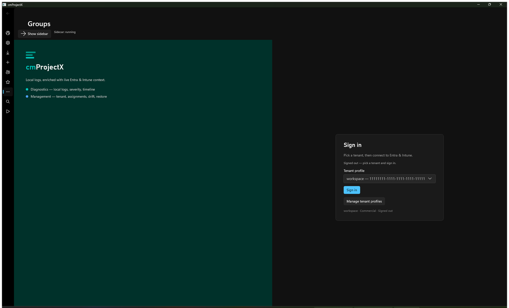

import { Steps } from '@astrojs/starlight/components';

IntuneCommander runs as **two processes**: the sidecar (the engine) and the client (the window you
use). Always start the **sidecar first** — the client talks to it over `http://127.0.0.1:5099`.

<Steps>

1. **Start the sidecar.** It listens on `http://127.0.0.1:5099`.

   ```powershell
   dotnet run --project service/Api
   ```

   :::note[Give it a moment]
   The sidecar **cold-starts in about 6 seconds**. The client starts instantly, so if you launch
   it first it simply waits until the sidecar is up.
   :::

2. **Launch the client** in a second terminal.

   ```powershell
   ./target/debug/app.exe
   ```

3. **Confirm they're talking.** The status bar shows **Sidecar: running**. You can also check the
   sidecar's health endpoint directly:

   ```powershell
   curl http://127.0.0.1:5099/health
   ```

   A `200` response means the sidecar is up and reports its current auth state.

</Steps>



When the client opens you'll be **signed out** and see the **Sign in** card. That's expected —
nothing is connected to a tenant yet.

:::tip[Port 5099 already in use?]
If the sidecar fails to bind, another instance (or a previous run) may still hold the port. Close
the old process, then start the sidecar again.
:::

Next: [Sign in to your tenant](/sign-in/overview/) →
