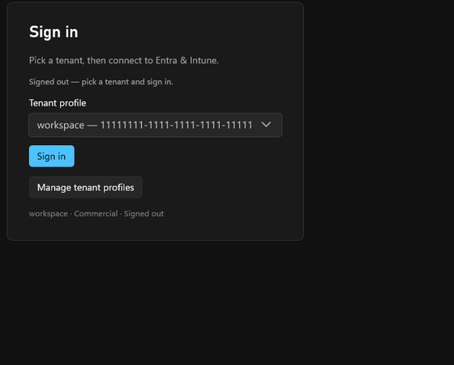

import { Steps, Tabs, TabItem } from '@astrojs/starlight/components';

## Sign in with a saved profile

<Steps>

1. In the **Sign in** card, choose your **Tenant profile** from the dropdown.

2. Click **Sign in**. The button shows _Signing in…_, then the status bar shows **Signed in**.

3. The live screens populate — you're connected.

</Steps>



What you see at step 2 depends on the profile's authentication method.

<Tabs>
<TabItem label="Client secret (silent)">

If the profile uses a **client secret** (app-only), sign-in completes **silently** in a few
seconds — there's no browser prompt. The status bar flips straight to **Signed in**.

</TabItem>
<TabItem label="Device code (interactive)">

If the profile uses **device code**, the card shows a short code and a verification link. Finish
in a browser:

> Finish signing in from a browser — enter **FQXJ-7K2D** at
> [microsoft.com/devicelogin](https://microsoft.com/devicelogin).

Once you approve in the browser, the app flips to **Signed in** on its own.

</TabItem>
</Tabs>

## From the command line

The sidecar exposes the same flow over HTTP, which is handy for scripting or a quick check:

```powershell
# Start sign-in (uses the active profile)
curl -X POST http://127.0.0.1:5099/auth/signin

# Liveness + current auth state
curl http://127.0.0.1:5099/health

# A protected surface: 409 before sign-in, rows after
curl http://127.0.0.1:5099/apps
```

:::tip[Refresh your audit snapshots]
After signing in, run a sync to refresh the audit/drift **time-machine**:

```powershell
curl -X POST http://127.0.0.1:5099/sync
```

:::

Trouble signing in? See [Troubleshooting](/sign-in/troubleshooting/).
