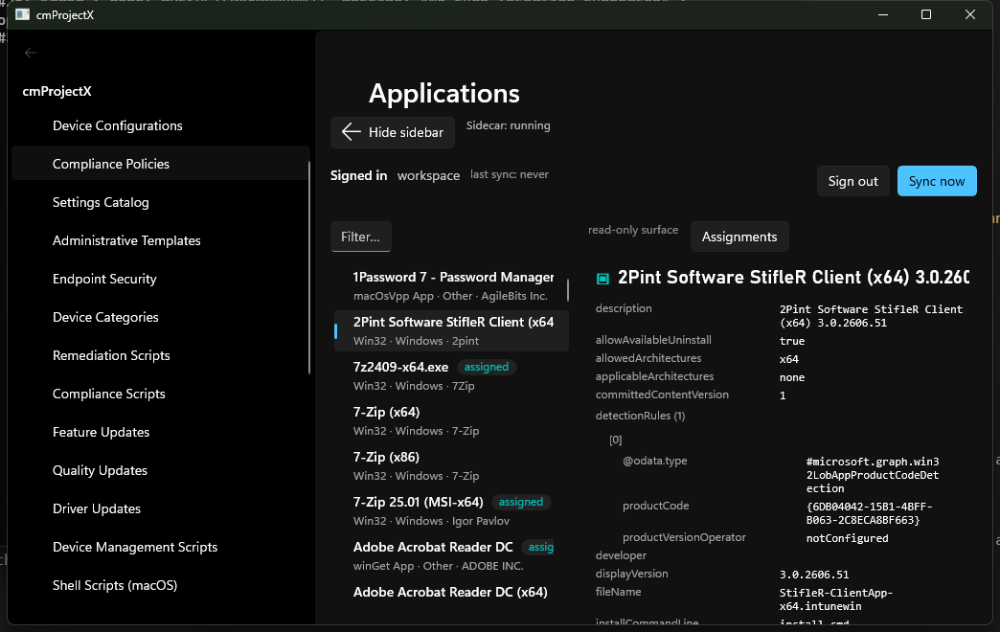

import { Steps } from '@astrojs/starlight/components';

Every management surface works the same way: a **list** on the left, a **detail pane** on the right.

<Steps>

1. **Pick a surface** from the navigation — say **Apps → Applications**.

2. **Scan the list.** Each item is normalised to a tidy row — a **title**, a **subtitle**
   (platform, publisher, type), and sometimes a **badge** (e.g. _assigned_). Use **Filter** to
   narrow a long list.

3. **Select a row.** The detail pane shows the **full object JSON** exactly as Graph returns it —
   every property, ready to read or copy.

</Steps>

## Read-only vs writable surfaces

Not every surface can be edited — some are read-only by design or by Graph's shape:

- **Read-only** (view + actions only): Conditional Access, VPP Tokens, Apple DEP, Cloud PC
  provisioning, Assignment Filters, Policy Sets, Managed Devices, and **Applications** (creating an
  app is a content-upload flow, out of scope — but you can still view and assign).
- **Writable**: most configuration, compliance, security, script, update, and tenant-admin
  surfaces. A writable surface shows an **Edit / Clone / Delete** toolbar — see
  [Edit safely](/using/edit-safely/).

:::note[Normalised on read]
Lists are normalised so they read consistently and so the **time-machine** can diff them without
noise. The detail pane always shows the real, full object.
:::

Next: [Edit safely](/using/edit-safely/) →
