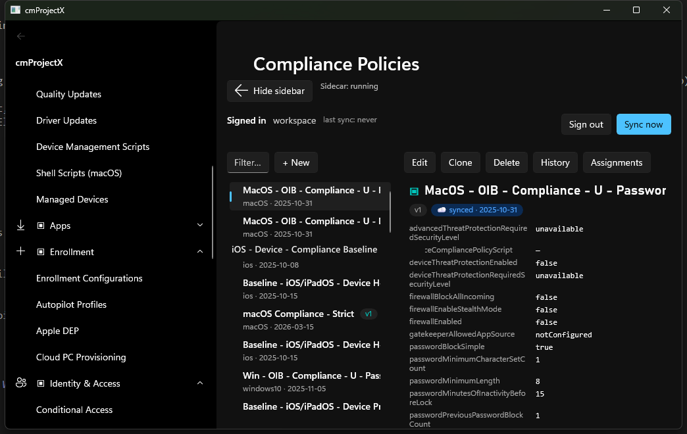

import { Steps } from '@astrojs/starlight/components';

On a writable surface the detail pane gains a toolbar: **Edit · Clone · Delete · History ·
Assignments**. Every change you make is **previewed, confirmed, and snapshotted** before and after
it touches your tenant.

## The write path

<Steps>

1. **Edit** opens the object's normalised JSON in an editor.

2. **Diff preview** shows exactly what will change versus the current state — the same diff engine
   the drift view uses, so there are no surprises.

3. **Confirm.** A dialog summarises the change set in plain language before anything is sent.

4. **Save.** IntuneCommander `PATCH`/`POST`s the change, then **captures a fresh snapshot** — so the new
   state is itself in the time-machine.

</Steps>

## Safety rails

- **Diff before write** — no mutation happens without a preview.
- **Optimistic concurrency** — the object's `@odata.etag` is sent with an `If-Match`; if someone
  else changed it first, you'll be asked to re-fetch and re-diff instead of clobbering their change.
- **Undo via the time-machine** — because each write is snapshotted, **History → restore** re-applies
  any earlier snapshot. Point-in-time rollback is a first-class feature, not an afterthought.
- **Clone** copies an object (ids stripped) as a starting point for a new one.

:::caution[Writes hit the live tenant]
There is no sandbox. While you're learning, make changes on **low-risk objects** — Scope Tags,
Device Categories — rather than production policy. The diff-and-confirm gate is there to protect you,
but the change is real.
:::

Next: [Assignments](/using/assignments/) →
